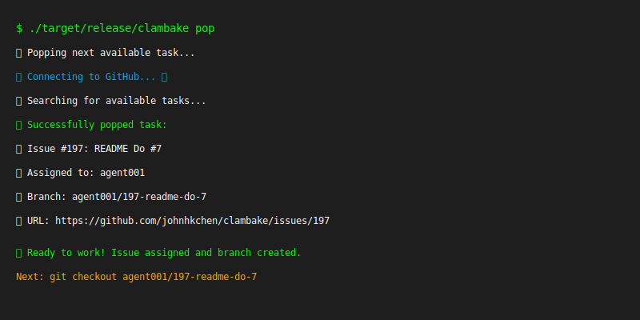
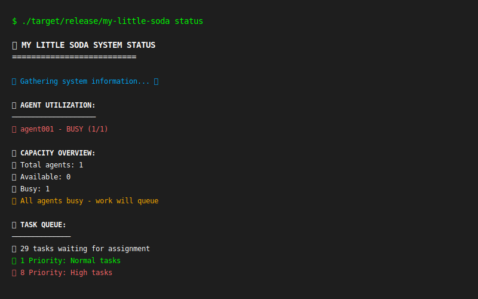
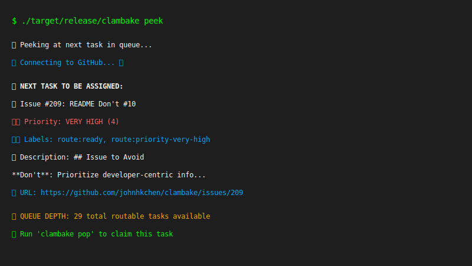

# Clambake

[](https://github.com/johnhkchen/clambake/actions/workflows/property-tests.yml)
[](https://opensource.org/licenses/MIT)
[](https://github.com/johnhkchen/clambake)
[](https://www.rust-lang.org/)
[](https://github.com/johnhkchen/clambake)

Turn GitHub Issues into a job queue for AI coding agents—coordinate multiple autonomous developers working on your repository simultaneously.

## 🚀 Key Features & Benefits

- **🤖 Multi-Agent AI Coordination** - First GitHub-native orchestration system for autonomous coding agents
- **🔀 Zero-Conflict Parallel Work** - Automatic branch isolation prevents merge conflicts between concurrent agents
- **🎯 Smart Issue Routing** - Priority-based task assignment with intelligent agent coordination and capacity management
- **⚡ 3-Phase Workflow** - Work → Review → Merge cycle ensures code quality while maintaining development velocity
- **👁️ GitHub-Native Transparency** - All coordination visible through labels and PRs—no hidden state or external databases
- **🌍 Cross-Platform Ready** - Works seamlessly on Linux, macOS, and Windows with all dependencies
- **📊 Rate-Limit Aware** - Built-in GitHub API optimization prevents rate limiting during sustained operation
- **🔍 Automated Code Review Integration** - CodeRabbit feedback automatically converted to actionable follow-up tasks

**Why Choose Clambake?** Scale your development team with AI agents that work like human developers—isolated branches, proper reviews, and coordinated effort without stepping on each other's work.

> 💡 **Visual Examples**: This README includes live terminal output examples and workflow demonstrations to help you understand how Clambake works in practice. Look for the 📊 console output sections throughout the documentation.

**Development Status: Early Alpha**  
This tool is under active development with compilation warnings and incomplete features. Use for experimentation only.

## Table of Contents

- [What It Currently Does](#what-it-currently-does)
- [Prerequisites](#prerequisites)
  - [System Requirements](#system-requirements)
  - [GitHub Requirements](#github-requirements)
  - [Authentication Setup](#authentication-setup)
  - [Repository Configuration](#repository-configuration)
- [Installation](#installation)
- [Quick Start](#quick-start)
- [Configuration](#configuration)
  - [Configuration File Setup](#configuration-file-setup)
  - [Environment Variable Reference](#environment-variable-reference)
- [AI Agent Coordination Domain](#ai-agent-coordination-domain)
  - [What Clambake Does](#what-clambake-does)
  - [Domain-Specific Setup Requirements](#domain-specific-setup-requirements)
  - [Agent Workflow Understanding](#agent-workflow-understanding)
  - [AI Service Integration](#ai-service-integration)
- [Advanced Usage](#advanced-usage)
- [Required GitHub Labels](#required-github-labels)
- [Troubleshooting](#troubleshooting)
  - [Authentication Issues](#authentication-issues)
  - [Configuration Issues](#configuration-issues)
  - [GitHub API Issues](#github-api-issues)
  - [Build Issues](#build-issues)
  - [Runtime Issues](#runtime-issues)
  - [Getting Help](#getting-help)
- [Documentation](#documentation)
- [Contributing](#contributing)
- [License](#license)

## What It Currently Does

Routes GitHub Issues labeled `route:ready` to available agents by:
- Creating isolated git branches for each assigned issue
- Adding agent labels (e.g., `agent001`) to track assignments
- Managing basic agent state through GitHub Issue labels

## Prerequisites

### System Requirements
- **Rust 1.75+** - Required for compilation
- **Git 2.30+** - Required for branch management  
- **GitHub CLI (gh)** - Required for seamless GitHub integration

**Platform Support**: Clambake works on Linux, macOS, and Windows. All core dependencies are cross-platform compatible.

### GitHub Requirements
- **GitHub repository** with Issues enabled
- **GitHub personal access token** with the following scopes:
  - `repo` - Full repository access
  - `workflow` - GitHub Actions (if using automated agents)
  - `read:org` - Organization access (if repository is in an organization)
  - `gist` - For storing agent logs and debugging information

### Authentication Setup

#### Option 1: GitHub CLI (Recommended)
The GitHub CLI provides the most seamless authentication experience:

```bash
# Install GitHub CLI (if not already installed)
# On Ubuntu/Debian: sudo apt install gh
# On macOS: brew install gh
# On other systems: see https://cli.github.com/

# Authenticate with GitHub
gh auth login

# Verify authentication
gh auth status
```

#### Option 2: Manual Token Setup
If you prefer manual token configuration:

1. **Create a GitHub Personal Access Token**:
   - Go to GitHub → Settings → Developer settings → Personal access tokens → Tokens (classic)
   - Generate new token with scopes: `repo`, `workflow`, `read:org`, `gist`
   - Copy the token (starts with `ghp_` or `github_pat_`)

2. **Configure the token** using one of these methods:

   **Method A: Environment Variable**
   ```bash
   export CLAMBAKE_GITHUB_TOKEN="ghp_your_personal_access_token_here"
   ```

   **Method B: Credential File**
   ```bash
   mkdir -p .clambake/credentials
   echo "ghp_your_personal_access_token_here" > .clambake/credentials/github_token
   ```

   **Method C: Configuration File** (see Configuration section below)

### Repository Configuration

Clambake needs to know which GitHub repository to manage. Configure this in `clambake.toml`:

```toml
[github]
owner = "your-username"        # or organization name
repo = "your-repository-name"
```

Alternatively, use environment variables:
```bash
export GITHUB_OWNER="your-username"
export GITHUB_REPO="your-repository-name"
```

## Installation

### Build from Source

```bash
git clone https://github.com/johnhkchen/clambake.git
cd clambake
cargo build --release
```

The binary will be available at `./target/release/clambake`.

**Platform Requirements:**
- **Linux**: `build-essential` package
- **macOS**: Xcode command line tools (`xcode-select --install`)
- **Windows**: Visual Studio Build Tools

**Optional**: Add to PATH for global access:
```bash
# Linux/macOS
export PATH="$PWD/target/release:$PATH"

# Or copy to system location
sudo cp target/release/clambake /usr/local/bin/
```

**Verify installation:**
```bash
./target/release/clambake --help
```

## Quick Start

Once installed and configured, here's how to get started with Clambake:

### 1. Set up your GitHub repository
First, ensure your repository has the required labels. Use GitHub CLI to create them:
```bash
# Create routing labels
gh label create "route:ready" --description "Issues ready for agent assignment" --color "0e8a16"
gh label create "route:priority-high" --description "High priority tasks" --color "d93f0b"
gh label create "route:priority-medium" --description "Medium priority tasks" --color "fbca04"
gh label create "route:priority-low" --description "Low priority tasks" --color "bfd4f2"

# Create agent labels
gh label create "agent001" --description "Assigned to agent001" --color "1d76db"
gh label create "agent002" --description "Assigned to agent002" --color "1d76db"
```

Expected output:
```
✅ label "route:ready" created  
✅ label "route:priority-high" created
✅ label "route:priority-medium" created
✅ label "route:priority-low" created
✅ label "agent001" created
✅ label "agent002" created
```

### 2. Create a GitHub issue and label it
Create an issue in your repository and add the `route:ready` label to make it available for agent assignment.

### 3. Get your first task
Simulate an AI agent picking up work:
```bash
./target/release/clambake pop
```

**Live Example Output:**

```console
🎯 Popping next available task...

🔄 Connecting to GitHub... ✅
📋 Searching for available tasks... 📊 Available agents: 1 of 1 total
🤖 Attempting atomic assignment: agent agent001 -> issue #197
✅ Reserved assignment: agent agent001 -> issue #197 (capacity: 1/1)
✅ Issue #197 assigned to GitHub user: johnhkchen
🏷️  Adding agent label: agent001
✅ Added agent label: agent001
🌿 Creating agent branch: agent001/197-readme-do-7-use-screenshots-or
🌿 Creating branch 'agent001/197-readme-do-7-use-screenshots-or' from 'main'
✅ Branch 'agent001/197-readme-do-7-use-screenshots-or' created successfully
🎯 ATOMIC ASSIGNMENT COMPLETE: agent agent001 -> issue #197

✅ Successfully popped task:
  📋 Issue #197: README Do #7: Use screenshots or GIFs to demonstrate functionality
  👤 Assigned to: agent001
  🌿 Branch: agent001/197-readme-do-7-use-screenshots-or
  🔗 URL: https://github.com/johnhkchen/clambake/issues/197

🚀 Ready to work! Issue assigned and branch created/targeted.
   Next: git checkout agent001/197-readme-do-7-use-screenshots-or
```

### 4. Check system status
See what's happening across all agents:
```bash
./target/release/clambake status
```

**Live Example Output:**

```console
🤖 CLAMBAKE SYSTEM STATUS
==========================

🔄 Gathering system information... ✅

📊 AGENT UTILIZATION:
────────────────────
🔴 agent001 - BUSY (1/1)

💼 CAPACITY OVERVIEW:
   🎯 Total agents: 1
   ✅ Available: 0
   🔴 Busy: 1
   ⏳ All agents busy - work will queue

📋 TASK QUEUE:
──────────────
📊 29 tasks waiting for assignment
   🟢 1 Priority: Normal tasks
   🔴 8 Priority: High tasks
   🔴 13 Priority: Very High tasks
   🟢 2 Priority: Low tasks
   🟡 5 Priority: Medium tasks

🎯 QUICK ACTIONS:
   → clambake pop      # Claim next task
   → clambake peek     # Preview next task
   → clambake route    # Route tasks to agents
   → clambake land     # Complete lifecycle
```

### 5. Complete the work cycle
After implementing your solution, land your work to create a PR:
```bash
./target/release/clambake land
```

This creates a pull request and frees the agent to pick up the next task.

### Real-World Example Workflow
Here's how Clambake works in practice:

1. **Create issues** with `route:ready` labels
2. **Agents pick up work** with `clambake pop` 
3. **Implement solutions** on isolated branches
4. **Land completed work** with `clambake land` (creates PR)
5. **System routes next task** automatically

The 3-phase workflow (Work → Review → Merge) ensures code quality while maintaining development velocity.

#### Visual Workflow Demonstration
The following example shows a complete agent workflow cycle:


**Step 1: Agent Claims Task**
```console
$ ./target/release/clambake pop
🎯 Popping next available task...
✅ Successfully popped task:
  📋 Issue #42: Fix authentication bug
  👤 Assigned to: agent001
  🌿 Branch: agent001/42-fix-authentication-bug
```

**Step 2: Agent Implements Solution**
```console
$ git checkout agent001/42-fix-authentication-bug
$ # Make code changes...
$ git add . && git commit -m "Fix authentication validation logic"
```

**Step 3: Agent Lands Work (Creates PR)**
```console
$ ./target/release/clambake land
🚀 Landing completed work...
✅ Pull request created: #123
🎯 Agent freed - ready for next task!
```

## Configuration

Clambake uses a layered configuration system with the following precedence:
1. Environment variables (highest priority)
2. Configuration file (`clambake.toml`)
3. Default values (lowest priority)

### Configuration File Setup
Copy the example configuration and customize it:

```bash
cp clambake.example.toml clambake.toml
```

Key configuration sections:

```toml
[github]
owner = "your-username"
repo = "your-repo"

[github.rate_limit]
requests_per_hour = 5000
burst_capacity = 100

[agents]
max_agents = 4
coordination_timeout_seconds = 300

[observability]
tracing_enabled = true
log_level = "info"
```

### Environment Variable Reference

All configuration options can be overridden with environment variables using the `CLAMBAKE_` prefix:

```bash
# GitHub settings
export CLAMBAKE_GITHUB_TOKEN="ghp_your_token"
export CLAMBAKE_GITHUB_OWNER="your-username"
export CLAMBAKE_GITHUB_REPO="your-repo"

# Agent settings
export CLAMBAKE_AGENTS_MAX_AGENTS=8
export CLAMBAKE_AGENTS_COORDINATION_TIMEOUT_SECONDS=600

# Observability
export CLAMBAKE_OBSERVABILITY_LOG_LEVEL="debug"
export CLAMBAKE_OBSERVABILITY_TRACING_ENABLED=true
```

## AI Agent Coordination Domain

### What Clambake Does
Clambake orchestrates AI coding agents (like Claude Code) to work on GitHub Issues collaboratively. It implements a sophisticated multi-agent coordination system where:

- **Agents** are AI assistants that autonomously complete coding tasks
- **Issues** are routed to available agents based on labels and priorities  
- **Branches** are created automatically for each agent's work to prevent conflicts
- **Coordination** happens through GitHub's native features (labels, PRs, reviews)

### Domain-Specific Setup Requirements

#### GitHub Issue Labels
Your repository must have these labels for the routing system:

**Priority Labels:**
- `route:priority-very-high` - Critical tasks (Priority 4)
- `route:priority-high` - Important tasks (Priority 3) 
- `route:priority-medium` - Standard tasks (Priority 2)
- `route:priority-low` - Nice-to-have tasks (Priority 1)

**Routing Labels:**
- `route:ready` - Issues ready for agent assignment
- `route:land` - Merge-ready work needing final review
- `route:unblocker` - Critical system issues blocking other work

**Agent Assignment Labels:**
- `agent001`, `agent002`, `agent003`, etc. - Track which agent is working on which issue

**Feedback Labels:**
- `coderabbit-feedback` - Issues created from AI code review feedback
- `supertask-decomposition` - Sub-tasks broken down from larger work

Create these labels automatically:
```bash
# After authentication, run:
./target/release/clambake setup-labels
```

#### Agent Workflow Understanding
Agents operate in a **3-phase workflow**:

1. **Phase 1: Work → PR** - Agent implements solution and creates pull request
2. **Phase 2: Review** - CodeRabbit AI reviews the pull request  
3. **Phase 3: Merge** - Agent decomposes feedback into follow-up issues and merges

This prevents work-in-progress from blocking the system while ensuring code quality through automated review cycles.

#### AI Service Integration
While Clambake manages the coordination, the actual AI agents (like Claude Code) need:
- Access to the repository for reading/writing code
- Ability to create commits and branches
- Understanding of the issue requirements and acceptance criteria

The coordination system tracks agent state through GitHub labels, not internal databases, making it transparent and debuggable.

## Advanced Usage

### Multi-Agent Coordination
Run multiple agents simultaneously:
```bash
./target/release/clambake route --agents 3
```

### Monitoring and Management
Check detailed system status:
```bash
./target/release/clambake status --verbose
```

View available work without assignment:
```bash
./target/release/clambake peek
```

**Example: Previewing Next Task**

```console
👀 Peeking at next task in queue...

🔄 Connecting to GitHub... ✅
🎯 NEXT TASK TO BE ASSIGNED:
   📋 Issue #209: README Don't #10: Don't prioritize dev info over user needs
   🏷️  Priority: VERY HIGH (4)
   🏷️  Labels: route:ready, route:priority-very-high
   📄 Description: ## Issue to Avoid

**Don't**: Prioritize developer-centric info over user needs in the README.

## Problem
Starting README with build instructions or internal design notes forces users to scroll to fi...
   🔗 URL: https://github.com/johnhkchen/clambake/issues/209

📈 QUEUE DEPTH: 29 total routable tasks available
💡 Run 'clambake pop' to claim this task
```

## Required GitHub Labels

The labels mentioned in the AI Agent Coordination section are created automatically, but if needed manually:
- `route:ready` - Issues ready for agent assignment  
- `agent001`, `agent002`, etc. - Agent assignments

## Troubleshooting

### Authentication Issues

**Problem**: `GitHub token not found` error
```bash
# Solution: Verify token configuration
gh auth status

# If not authenticated:
gh auth login

# Or set environment variable:
export CLAMBAKE_GITHUB_TOKEN="your_token_here"

# Or check credential file:
cat .clambake/credentials/github_token
```

**Problem**: `Permission denied` errors
- Ensure your token has `repo`, `workflow`, `read:org`, and `gist` scopes
- For organization repos, you may need additional org-level permissions

### Configuration Issues

**Problem**: `Configuration file not found`
```bash
# Copy and customize the example:
cp clambake.example.toml clambake.toml

# Edit with your repository details:
[github]
owner = "your-username"
repo = "your-repo"
```

**Problem**: Environment variables not taking effect
- Environment variables must use the `CLAMBAKE_` prefix
- Restart your shell after setting variables
- Check precedence: env vars > config file > defaults

### GitHub API Issues

**Problem**: Rate limit exceeded
- Default limit is 5,000 requests/hour for authenticated users
- Configure rate limiting in `clambake.toml`:
```toml
[github.rate_limit]
requests_per_hour = 5000
burst_capacity = 100
```

**Problem**: `Repository not found` errors
- Verify repository name and owner in config
- Ensure your token has access to the repository
- For private repos, token needs appropriate permissions

### Build Issues

**Problem**: Compilation errors
```bash
# Ensure you have the correct Rust version:
rustc --version  # Should be 1.75+

# Clean and rebuild:
cargo clean
cargo build --release
```

**Problem**: Missing system dependencies
```bash
# Ubuntu/Debian:
sudo apt update && sudo apt install build-essential git

# macOS:
xcode-select --install

# Windows: Install Visual Studio Build Tools
```

### Runtime Issues

**Problem**: No issues found to route
- Check that issues have the `route:ready` label
- Verify repository configuration is correct
- Ensure you have read access to the repository's issues

**Problem**: Branch creation failures
- Verify Git is configured with user name and email:
```bash
git config --global user.name "Your Name"
git config --global user.email "your.email@example.com"
```

### Getting Help

If you encounter issues not covered here:
1. Check the [spec.md](spec.md) for architectural details
2. Enable debug logging: `export CLAMBAKE_OBSERVABILITY_LOG_LEVEL=debug`
3. Run with verbose output: `cargo run -- <command> --verbose`
4. Review the `/docs` directory for comprehensive documentation

## Documentation Quick Links

Comprehensive documentation organized for different audiences and use cases:

### 📚 User Documentation
- **[User Guide](docs/README.md)** - Complete documentation from quickstart to production
- **[Command Reference](docs/README.md#commands-commandsmd)** - All CLI commands with examples
- **[Configuration Guide](docs/README.md#configuration-configurationmd)** - Setup and customization options
- **[Troubleshooting Guide](docs/README.md#troubleshooting-troubleshootingmd)** - Common issues and solutions

### 🏗️ Architecture & Specifications  
- **[System Specification](spec.md)** - Complete system architecture and design principles
- **[Domain Specifications](specs/README.md)** - Detailed technical specifications by domain
- **[API Documentation](https://docs.rs/clambake)** - Auto-generated Rust API docs

### 🤖 Agent Integration
- **[Agent Lifecycle](docs/agent_lifecycle.md)** - How agents coordinate and work together
- **[System Analysis](docs/system_analysis_and_opportunities.md)** - Agent coordination patterns
- **[Infrastructure Guide](INFRASTRUCTURE.md)** - Deployment and operational requirements

### 🛠️ Development Resources
- **[Testing Strategy](docs/testable_architecture.md)** - Comprehensive testing approach
- **[Contributing Guidelines](specs/README.md#contributing-to-specs)** - How to contribute to the project
- **[Scripts Documentation](scripts/README.md)** - Development and maintenance scripts

## Contributing

See build warnings when running `cargo check`. Many features are stubbed out and need implementation.

## License

MIT License - See [LICENSE](LICENSE) for details.